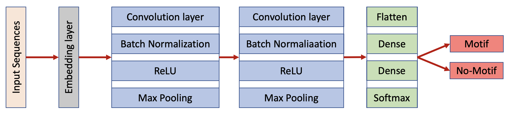
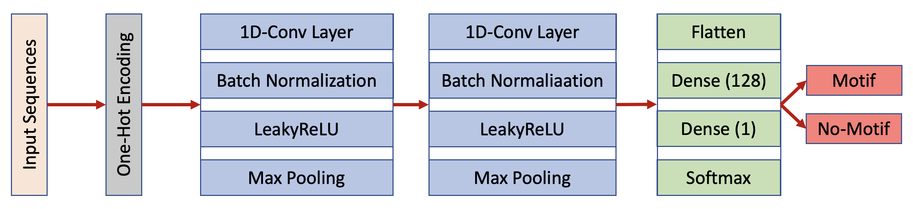

# STALIN28

## _LIN28A binding motif predictor using Machine Learning_

- - -

### Working Process
- Prepare Dataset
	- Gather Training/Test Dataset
		- https://github.com/mstrazar/iONMF (CLIP-seq data with Class Label) _(DONE)_
	- Gather Data from SRA
		- SRP012118 (HITS-CLIP data) _(DONE)_
	- Data Preprocessing
		- Convert public dataset into pandas dataframe (WORKING ON)
- Train Model
	- Construct CNN-based ML Model
		- 1DConv model (WORKING ON)

- Predict Binding Motif of LIN28

	(sample schematic of CNN architecture)
	
	

- Additional Aanlysis

- - - 

### REFERNECE
- LIN28A Is a Suppressor of ER-Associated Translation in Embryonic Stem Cells _(DOI: 10.1016/j.cell.2012.10.019)_
- Computational analysis of CLIP-seq data _(DOI: 10.1016/j.ymeth.2017.02.006)_
- Recent Advances in Machine Learning Based Prediction of RNA-protein Interactions _(DOI: 10.2174/0929866526666190619103853)_
- Improved Predicting of The Sequence Specificities of RNA Binding Proteins by Deep Learning _(DOI: 10.1109/TCBB.2020.2981335)_
